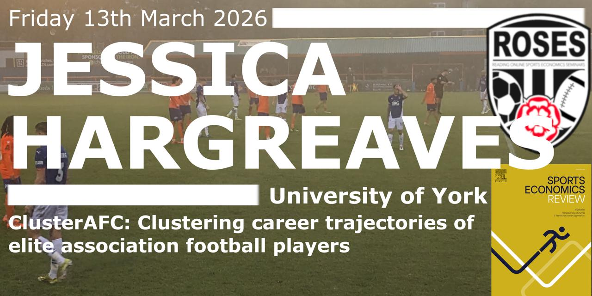

## 2026 ROSES Talk

The two hundred and twenty sixth Reading Online Sport Economics Seminar (ROSES), sponsored by the Sports Economics Review published by Elsevier was given by Jess Hargreaves, of the University of York, presenting "[**ClusterAFC: Clustering career trajectories of elite association football players**](https://www.youtube.com/watch?v=63jie_9vbVI)", a project that she is currently working on with Rich Bingham (QSAY) and James Reade (University of Reading).

**Abstract:**

Identifying an athlete's long-term potential is a central challenge in talent identification. In association football, this has led to increasing demand for objective methods that can assess and compare players' career trajectories. In this talk, we present **ClusterAFC**, a pattern-recognition toolkit for the **Cluster Analysis of Football Careers**. We represent a player's career as a time series of performance ratings (e.g. [Player Elo Ratings](https://www.youtube.com/watch?v=jJ44yQF7olo)) and apply clustering techniques to group players with similar career development patterns. We introduce a comprehensive set of features extracted from individual rating time series and identify the variables that provide the greatest discriminatory power. We employ two clustering algorithms to characterise heterogeneous career subsets, and then compare and contrast the results. This framework represents a first step towards providing stakeholders in association football with an objective, data-driven perspective on players' career trajectories, using freely available data sources.

This was an online seminar and was the two hundred and twenty sixth sport economics seminar hosted by the University of Reading. ROSES was initiated in the time of Coronavirus, as a means for researchers in the field to present their work and interact with like-minded scholars on a regular basis during lockdowns and social distancing and isolation around the world. ROSES continues to meet now, as the platform provides a regular opportunity for researchers in economics and sport to present in a less rushed setting. The 90-minute slot gives plenty of time for a presentation and discussion and researchers often use this opportunity to discuss "work in progress" to gain insightful feedback.

If you want to join these events, please contact James Reade (j.j.reade\@reading.ac.uk). They take place via Microsoft Teams each Friday, 2:30pm-4pm UK time.
