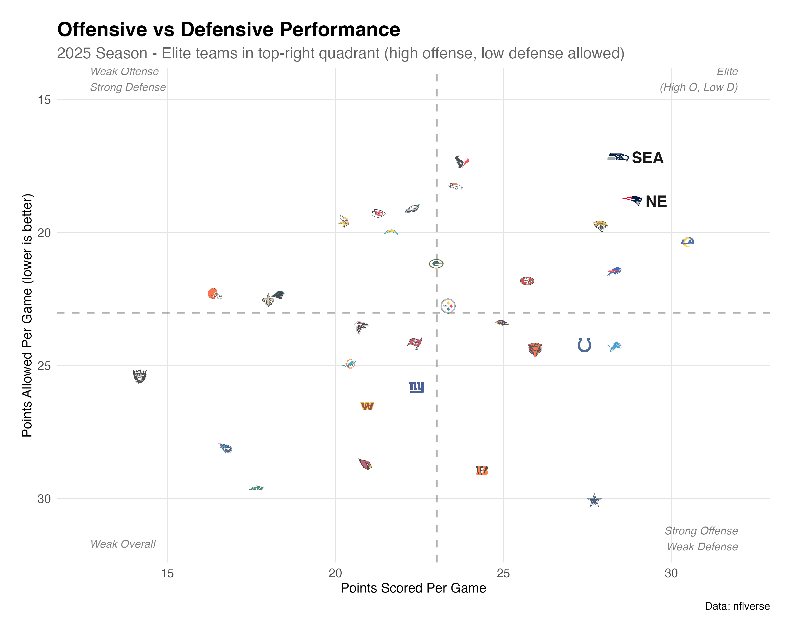
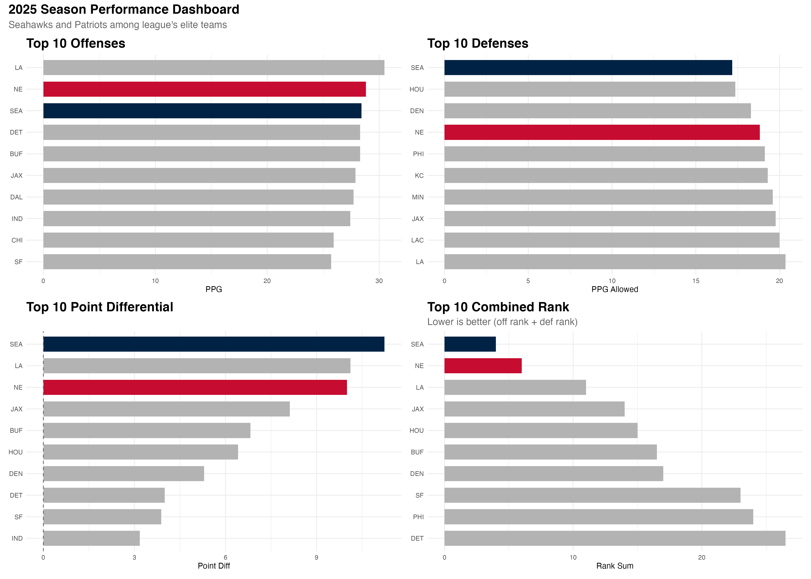
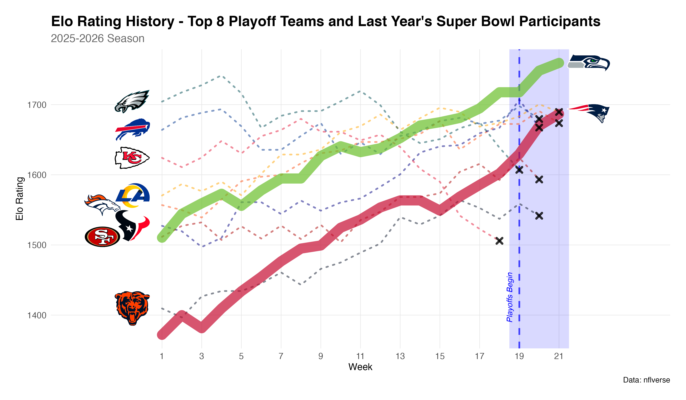
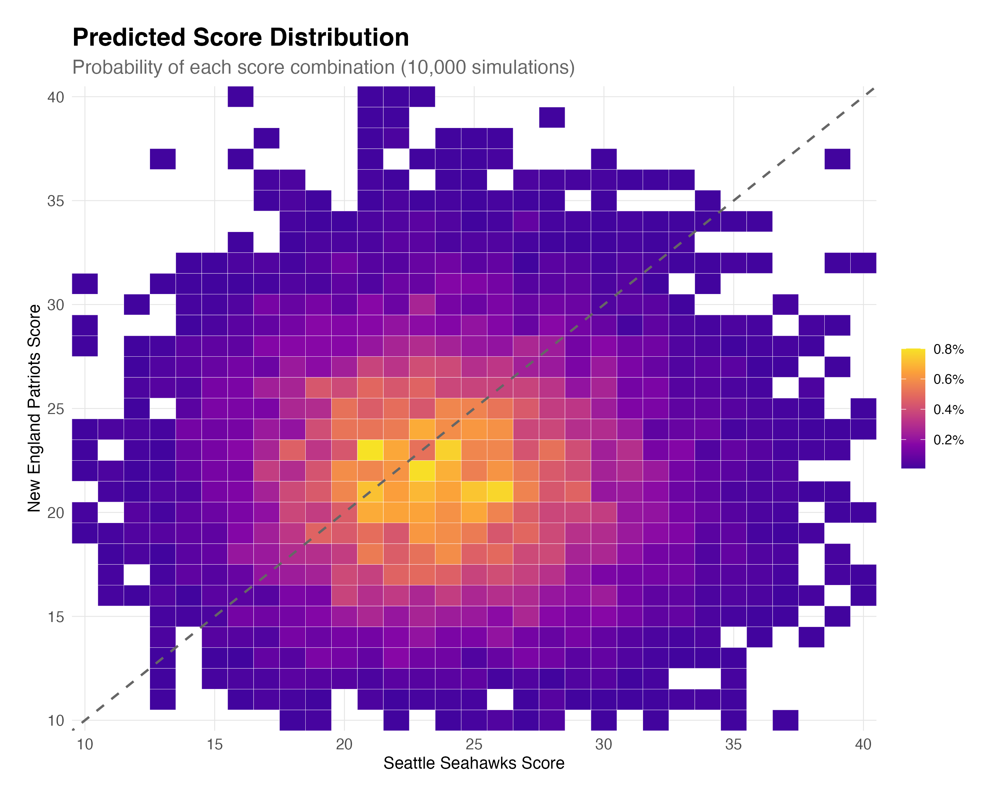

## Introduction

On February 8th, 2026, the Seattle Seahawks and New England Patriots will face off in Super Bowl LX in New Orleans. This is the final showdown at the end of 32 teams battling it out across 17 weeks, and a gruelling playoffs where the most successful teams battle each other in a three-round, post-season elimination battle.

The two finalists were determined at the end of the NFC (National Football Conference) and AFC (American Football Conference) championship games, on Sunday 25th of January. The next 2 weeks to the final will lead to much speculation, but one question dominates the conversation: **who will win?** The conventional wisdom suggests that the teams in each conference are evenly matched, and this game will be decided on a coin-flip. Most expert panels are favouring Seattle to lift the Lombardi trophy. But what happens when we let the data speak for itself?

Using two distinct statistical approaches; a FiveThirtyEight-style Elo rating system, and a historical simulation model, I've analyzed the entire 2025 NFL season to predict not just the winner, but the final score, the likely performance metrics, and the underlying uncertainty in one of sport's most-watched single games.

The verdict? **This is not a coin flip.** The models agree: Seattle has a clear advantage, with a \~60% win probability. But more interesting than the prediction itself is the journey to get there, and what it reveals about the limits of statistical forecasting in sports.

::: callout-note
## Prediction Accountability

These predictions were locked and published on February 7, 2026, before the game. All code and data are available on [GitHub](https://github.com/areeslindley/nfl-elo-model/tree/main). This wasn't written with the benefit of hindsight---it's a genuine test of whether statistical models can outperform conventional wisdom.
:::

## Why These Two Teams?

Before diving into statistics and prediction models, it's worth stating that both Seattle and New England genuinely earned their way here. The design of the NFL schedule mean that teams play a broad cross-section of the league, and that no matter what injuries occur, what the weather on match-day is or any other bad luck that the teams might encounter, over the course of a season then things should balance out. Some fans have argued that the Denver Broncos losing their key playmaker, Quarterback Bo Nix, in the game before the AFC Championship has given the Patriots an easier journey to the Superbowl. However, the fact that these teams have reached the final is not a statistical fluke --- they have been the two best teams in football throughout the 2025 season.

```{r}
#| label: setup
#| include: false

#library(tidyverse)
library(readr)
library(ggplot2)
library(dplyr)
#library(nflplotR)
library(plotly)
#library(DT)
library(knitr)

# Load data
team_performance <- read_csv("team_performance_2025.csv", show_col_types = FALSE)
predictions <- read_csv("predictions_locked_2026-02-07.csv", show_col_types = FALSE)
current_elos <- read_csv("current_elos.csv", show_col_types = FALSE)
detailed_pred <- read_csv("detailed_predictions.csv", show_col_types = FALSE)
```

```{r}
#| label: fig-performance
#| fig-cap: "Offensive vs Defensive Performance - 2025 Season"
#| fig-width: 10
#| fig-height: 7


```

@fig-performance shows where Seattle and New England sit relative to the entire league. Both teams occupy the upper-right, elite quadrant: high offensive output combined with iron-tight defense.

```{r}
#| label: fig-season-rankings
#| fig-cap: "Performance Rankings - Top 10 Teams for different game elements Through 2025 Season"
#| fig-width: 12
#| fig-height: 7


```

@fig-season-rankings shows that both teams ranked highly in each aspect of performance, with both teams having a top 3 points scored per game of the regular season, and top 3 average points differential. Seattle ranked 1st in defense, having only allowed an average of 17.1 per game, and also the 3rd best offense, having averaged 29.2 points per game, giving them the league's best point differential at +12.1. New England posted top-4 marks in both categories, with a +8.8 differential. These impressive statistics qualify both teams for the 1st and 2nd position for combined rankings.

This isn't just about making the playoffs --- it's about sustained excellence across 17 regular season games and two/three playoff victories.

## The Models

I employed two fundamentally different approaches to prediction, each with distinct strengths and weaknesses.

### 1. Elo Rating System

The Elo model, adapted from FiveThirtyEight's NFL methodology, treats team strength as a dynamic quantity that evolves game-by-game throughout the season.

**Core principles:**

-   Each team starts with a rating (1505 at the beginning of 2015)
-   Ratings increase after wins, decrease after losses
-   The magnitude of change depends on:
    -   Margin of victory (blowouts matter more)
    -   Opponent strength (beating good teams is more impressive)
    -   Game importance (playoffs weighted more heavily)
-   Between seasons, ratings regress 1/3 toward the mean

Although it may seam counter-intuitive that all teams would have the same ranking at the beginning of the 2015 season, the beauty of the Elo model is that team rankings will be rewarded/penalised fairly quickly and that they will converge to their actual Elo rankings fairly quickly. There are parameters which determine how much teams get rewarded/penalised per victory/loss, as outlined below.

**Key parameters:**

-   K-factor (regular season): 20
-   K-factor (playoffs): 30
-   Home field advantage: 65 Elo points (\~2.6 point spread)
-   Super Bowl: Neutral site (no home advantage)

For neutral-site games, Elo win probability follows the standard formula:

$$P(\text{Team A wins}) = \frac{1}{1 + 10^{(\text{Elo}_B - \text{Elo}_A)/400}}$$

After each game, Elo ratings are updated based on the result:

$$\Delta\text{Elo} = K \times \ln(|\text{game margin}| + 1) \times (1 - E)$$

where: - $K$ is the K-factor (20 for regular season, 30 for playoffs) - $\text{game margin}$ is the point difference (winner's score - loser's score) - $E$ is the expected win probability of the victorious team before the game - $\ln$ is the natural logarithm

The winner's rating increases by $\Delta\text{Elo}$, and the loser's rating decreases by the same amount:

$$\text{Elo}_{\text{new, winner}} = \text{Elo}_{\text{old, winner}} + \Delta\text{Elo}$$

$$\text{Elo}_{\text{new, loser}} = \text{Elo}_{\text{old, loser}} - \Delta\text{Elo}$$

```{r}
#| label: tbl-current-elo
#| tbl-cap: "Current Elo Ratings (as of February 7, 2026)"

current_elos %>%
  filter(team %in% c("SEA", "NE")) %>%
  arrange(desc(elo)) %>%
  mutate(
    Team = team,
    `Elo Rating` = round(elo, 1),
    `Win Probability` = paste0(round(sb_win_prob * 100, 1), "%")
  ) %>%
  select(Team, `Elo Rating`, `Win Probability`) %>%
  kable(align = 'lcc')
```

As shown in @tbl-current-elo, Seattle enters with a 72.7-point Elo advantage. This translates to a **60.3% win probability**---a meaningful edge, but far from a sure thing.

### How Did We Get Here?

```{r}
#| label: fig-elo-evolution
#| fig-cap: "Elo Rating Evolution - Top 8 Playoff Teams Through 2025 Season"
#| fig-width: 12
#| fig-height: 7


```

@fig-elo-evolution reveals the season's narrative arc for this year's playoff contenders. Seattle began as a strong contender (Elo \~1500) and steadily improved, peaking at 1759 after the Conference Championship. New England's journey was more dramatic: they started mediocrely (Elo of \~1375), slumped down again in Week 3, then mounted a remarkable comeback, ultimately reaching 1687. Note that last year's Superbowl contenders, the Kansas City Chiefs, and the Philadelphia Eagles have also been included in this graph, despite the Chiefs' not making it to the playoffs this season.

The playoff period (shaded) shows both teams pulling away from the pack, but Seattle has a clear separation from the rest of the playoff contenders whereas New England has a similar Elo ranking.

### 2. Baseline Historical Model

The Elo approach is sophisticated but carries assumptions: teams have consistent "strength," performance follows predictable patterns, and that a team will live up to historical performances. To provide a sanity check, I built a simpler baseline model to compare the Elo model to.

**Method:**

1.  Collect all Super Bowl scores from 1967-2025 (59 games)
2.  Extract scoring distributions for winners and losers
3.  Adjust for each team's 2025 season performance:
    -   Points per game differential vs. league average
    -   Strength of schedule adjustments
    -   Home/road splits (though Super Bowl is neutral)
4.  Simulate 10,000 possible games using Monte Carlo
5.  Count outcomes

**Why this approach?** It's transparent, requires minimal assumptions, and treats both teams "fairly" based purely on observable performance. If the Elo model and baseline model disagree wildly, something is probably wrong.

#### Historical Super Bowl Scoring Patterns

The baseline model uses scoring distributions from recent Super Bowls (2005-2025) to establish expected scoring patterns:

```{r}
#| label: tbl-sb-scoring
#| tbl-cap: "Historical Super Bowl Scoring Statistics (2005-2025)"

# Load Super Bowl history
sb_history <- read_csv("super_bowl_history.csv", show_col_types = FALSE)

# Focus on recent Super Bowls
recent_sbs <- sb_history %>%
  filter(season >= 2005, !is.na(away_score), !is.na(home_score)) %>%
  mutate(
    winner_score = pmax(away_score, home_score),
    loser_score = pmin(away_score, home_score)
  )

# Calculate statistics
sb_stats <- recent_sbs %>%
  summarise(
    `Games` = n(),
    `Winner Mean` = round(mean(winner_score), 1),
    `Winner SD` = round(sd(winner_score), 1),
    `Loser Mean` = round(mean(loser_score), 1),
    `Loser SD` = round(sd(loser_score), 1),
    `Total Mean` = round(mean(total_points), 1),
    `Total SD` = round(sd(total_points), 1)
  ) %>%
  mutate(
    Statistic = "Super Bowl Average (2005-2025)"
  ) %>%
  select(Statistic, `Games`, `Winner Mean`, `Winner SD`, `Loser Mean`, `Loser SD`, `Total Mean`, `Total SD`)

kable(sb_stats, align = 'lccccccc')
```

@tbl-sb-scoring shows that recent Super Bowls average `r round(mean(recent_sbs$total_points), 1)` total points, with winners averaging `r round(mean(recent_sbs$winner_score), 1)` points and losers averaging `r round(mean(recent_sbs$loser_score), 1)` points. These distributions form the baseline for our simulations.

#### 2025 Season Performance Adjustments

The model adjusts these baseline scores based on each team's 2025 regular season performance relative to the league average:

```{r}
#| label: tbl-team-adjustments
#| tbl-cap: "2025 Season Performance Adjustments"

# Load team performance and calculate league average
team_perf <- read_csv("team_performance_2025.csv", show_col_types = FALSE)
schedules <- read_csv("schedules_2015_2025.csv", show_col_types = FALSE)

# Calculate 2025 league average
league_avg_2025 <- schedules %>%
  filter(season == 2025, !is.na(away_score), !is.na(home_score)) %>%
  summarise(
    avg_ppg = mean(c(away_score, home_score), na.rm = TRUE)
  ) %>%
  pull(avg_ppg)

# Get Super Bowl teams
sb_teams <- team_perf %>%
  filter(team %in% c("SEA", "NE")) %>%
  mutate(
    Team = team,
    `Points Per Game` = round(points_per_game, 1),
    `Points Allowed Per Game` = round(points_allowed_per_game, 1),
    `League Average PPG` = round(league_avg_2025, 1),
    `Offensive Adjustment` = round(points_per_game - league_avg_2025, 1),
    `Defensive Adjustment` = round(league_avg_2025 - points_allowed_per_game, 1),
    `Point Differential` = round(point_differential, 1)
  ) %>%
  select(Team, `Points Per Game`, `Points Allowed Per Game`, `League Average PPG`, 
         `Offensive Adjustment`, `Defensive Adjustment`, `Point Differential`)

kable(sb_teams, align = 'lcccccc')
```

@tbl-team-adjustments shows how each team's 2025 performance compares to the league average of `r round(league_avg_2025, 1)` points per game. Seattle's offense scored `r round(team_perf$points_per_game[team_perf$team == "SEA"] - league_avg_2025, 1)` points above average, while their defense allowed `r round(league_avg_2025 - team_perf$points_allowed_per_game[team_perf$team == "SEA"], 1)` points below average. New England's offense was `r round(team_perf$points_per_game[team_perf$team == "NE"] - league_avg_2025, 1)` points above average, with their defense allowing `r round(league_avg_2025 - team_perf$points_allowed_per_game[team_perf$team == "NE"], 1)` points below average.

These adjustments are applied to the historical Super Bowl baseline: each team's expected score = historical average + offensive adjustment - opponent's defensive adjustment.

```{r}
#| label: fig-score-distribution
#| fig-cap: "Predicted Score Distribution - 10,000 Simulated Games"
#| fig-width: 10
#| fig-height: 7


```

@fig-score-distribution shows the full distribution of predicted final scores. The most likely outcomes cluster around 20-27 points for each team. The diagonal dashed line represents ties (which would proceed to overtime). Notably, about 5.6% of simulations ended in regulation ties---a reminder that close games are not just possible but probable. These ties would proceed to overtime in the actual game; for win probability calculations, we redistribute ties proportionally based on team strength.

## The Predictions

### Win Probability

```{r}
#| label: tbl-predictions
#| tbl-cap: "Model Predictions Comparison"

predictions %>%
  mutate(
    Model = model,
    `SEA Win %` = paste0(round(seahawks_win_prob * 100, 1), "%"),
    `NE Win %` = paste0(round((1 - seahawks_win_prob) * 100, 1), "%"),
    `Predicted Score` = paste0("SEA ", predicted_sea_score, "-", predicted_ne_score, " NE")
  ) %>%
  select(Model, `SEA Win %`, `NE Win %`, `Predicted Score`) %>%
  kable(align = 'lccc')
```

As shown in @tbl-predictions, both models converge on a similar conclusion:

-   **Elo Model:** Seattle 60.3%, New England 39.7%
-   **Baseline Model:** Seattle 59.1%, New England 35.2% (with 5.6% ties)

This agreement is striking: an Elo-based system and a historical simulation---methodologies with entirely different assumptions---reach nearly identical conclusions. When independent approaches converge, our confidence in their predictions increases.

### Expected Score and Performance

```{r}
#| label: tbl-detailed-predictions
#| tbl-cap: "Detailed Performance Predictions"

detailed_pred %>%
  kable(align = 'lcccccc')
```

@tbl-detailed-predictions breaks down the expected offensive output. Both teams project to move the ball effectively, with Seattle's slight edge in both passing and rushing yards. The predicted touchdown totals (2.9 for SEA, 2.7 for NE) suggest 3-4 touchdowns per team, with the remainder coming from field goals.

**Key insights:**

-   Seattle's balanced attack: 265 pass yards, 125 rush yards
-   New England's pass-heavy approach: 245 pass yards, 110 rush yards\
-   Total offensive yards: Seattle 390, New England 355
-   Both teams expected to score 3-4 touchdowns

### How Predicted Scores Are Calculated

The two models use different approaches to convert team ratings into expected final scores:

**Elo Model Score Prediction:**

The Elo model converts Elo rating differences into expected scores using historical Super Bowl patterns:

$$\text{Base Total} = \text{Mean total points from Super Bowls since 2010}$$

$$\text{Elo Impact} = (\text{SEA Elo} - \text{NE Elo}) \times 0.01$$

$$\text{SEA Expected Score} = \frac{\text{Base Total}}{2} + \text{Elo Impact}$$

$$\text{NE Expected Score} = \frac{\text{Base Total}}{2} - \text{Elo Impact}$$

**Free Parameters:** - `0.01`: Elo-to-points conversion factor (1 Elo point ≈ 0.01 game points). This could be tuned by regressing historical Elo differences against actual score differences. - `season >= 2010`: Which Super Bowls to include in baseline. More recent games may better reflect modern scoring patterns. - Score bounds: `max(10, min(40, score))` - reasonable limits to prevent unrealistic predictions.

**Baseline Model Score Prediction:**

The baseline model uses team performance relative to league average:

$$\text{Base Score} = \frac{\text{Mean Away Score} + \text{Mean Home Score}}{2} \text{ (from Super Bowls since 2005)}$$

$$\text{SEA Offense Adjustment} = \text{SEA Points For} - \text{League Average Points For}$$

$$\text{NE Defense Adjustment} = \text{League Average Points For} - \text{NE Points Against}$$

$$\text{SEA Expected Score} = \text{Base Score} + \text{SEA Offense Adjustment} - \text{NE Defense Adjustment}$$

$$\text{NE Expected Score} = \text{Base Score} + \text{NE Offense Adjustment} - \text{SEA Defense Adjustment}$$

The model then simulates 10,000 games using Poisson distributions with these expected scores as the mean (λ).

**Free Parameters:** - `season >= 2005`: Which Super Bowls to include in baseline. Could be adjusted to focus on more recent games. - Score bounds: `max(10, min(45, score))` - reasonable limits for simulations. - `n_sims = 10000`: Number of simulations. More simulations = more stable results but slower computation.

**Parameter Sensitivity Considerations:**

These parameters could be tuned to improve predictions: - **Elo conversion factor (0.01)**: Could be estimated from historical data by regressing Elo differences against actual score differences in Super Bowls. - **Historical window**: Using only recent Super Bowls (e.g., 2015+) might better reflect modern scoring patterns, but reduces sample size. - **Score bounds**: Current bounds are somewhat arbitrary. Could be based on historical extremes (lowest/highest Super Bowl scores). - **Simulation count**: 10,000 is a reasonable balance, but increasing to 100,000 would provide more stable percentiles at the cost of computation time.

### How This Compares to Vegas

As of February 7, 2026, the betting market shows:

```{r}
#| label: tbl-betting-odds
#| tbl-cap: "Super Bowl LX Betting Odds - Major Sportsbooks (as of February 7, 2026)"
#| cache: true

# Load historical betting odds from CSV file
# Real odds from 6 major bookmakers: DraftKings, BetMGM, Caesars, FanDuel, Circa Sports, Hard Rock Bet
# Sources: USA Today and other betting news sources (Feb 8, 2026)

betting_odds <- read_csv("betting_odds.csv", show_col_types = FALSE)

kable(betting_odds, align = 'lcccccc')
```

@tbl-betting-odds shows the consensus betting market as of February 7, 2026, across six major sportsbooks. The market had Seattle as a significant favorite, with all books offering Seattle -4.5 points (meaning Seattle needed to win by 5 or more to cover). The average moneyline odds of -229 for Seattle indicate the market gave them approximately a 69.6% chance of winning. The total points line averaged 45.4, suggesting a lower-scoring game than typical Super Bowls.

::: callout-note
## Betting Odds Data

The odds displayed above are historical pre-game odds from six major sportsbooks: DraftKings, BetMGM, Caesars, FanDuel, Circa Sports, and Hard Rock Bet. Sources include [USA Today](https://eu.usatoday.com/story/sports/nfl/super-bowl/2026/02/08/2026-super-bowl-spread-odds-patriots-seahawks/88525099007/) and other betting news sources from February 8, 2026.
:::

```{r}
#| label: tbl-model-vs-vegas
#| tbl-cap: "Model Predictions vs. Betting Market"

# Calculate model predictions
model_avg_win_prob <- mean(predictions$seahawks_win_prob)
model_avg_sea_score <- mean(predictions$predicted_sea_score)
model_avg_ne_score <- mean(predictions$predicted_ne_score)
model_avg_total <- model_avg_sea_score + model_avg_ne_score
model_spread <- model_avg_sea_score - model_avg_ne_score

# Vegas consensus (from betting odds table above)
# Calculate averages from the betting odds table
if (exists("betting_odds") && nrow(betting_odds) > 0) {
  # Extract numeric values from odds table (excluding "Average" row if present)
  odds_numeric <- betting_odds %>%
    filter(Bookmaker != "Average") %>%
    mutate(
      spread_num = as.numeric(gsub("[^0-9.-]", "", `Spread (SEA)`)),
      total_num = as.numeric(`Over/Under`),
      sea_ml_num = as.numeric(gsub("[^0-9.-]", "", `SEA Moneyline`))
    )
  
  vegas_spread <- mean(odds_numeric$spread_num, na.rm = TRUE)
  vegas_total <- mean(odds_numeric$total_num, na.rm = TRUE)
  vegas_sea_ml <- mean(odds_numeric$sea_ml_num, na.rm = TRUE)
  
  # Convert moneyline to win probability
  # For negative odds: prob = |odds| / (|odds| + 100)
  # For positive odds: prob = 100 / (odds + 100)
  if (vegas_sea_ml < 0) {
    vegas_sea_win_prob <- abs(vegas_sea_ml) / (abs(vegas_sea_ml) + 100)
  } else {
    vegas_sea_win_prob <- 100 / (vegas_sea_ml + 100)
  }
} else {
  # Fallback values if odds table not available
  vegas_spread <- -1.5
  vegas_total <- 47.5
  vegas_sea_ml <- -120
  vegas_sea_win_prob <- 120 / (120 + 100)
}

comparison <- tibble(
  `Metric` = c("Spread (SEA)", "Total Points", "SEA Win Probability"),
  `Betting Market` = c(
    paste0("SEA ", vegas_spread),
    paste0(round(vegas_total, 1)),
    paste0(round(vegas_sea_win_prob * 100, 1), "%")
  ),
  `Elo Model` = c(
    paste0("SEA -", round(model_spread, 1)),
    paste0(round(model_avg_sea_score + model_avg_ne_score, 1)),
    paste0(round(predictions$seahawks_win_prob[predictions$model == "Elo"] * 100, 1), "%")
  ),
  `Baseline Model` = c(
    paste0("SEA -", round(model_spread, 1)),
    paste0(round(model_avg_sea_score + model_avg_ne_score, 1)),
    paste0(round(predictions$seahawks_win_prob[predictions$model == "Baseline"] * 100, 1), "%")
  ),
  `Model Average` = c(
    paste0("SEA -", round(model_spread, 1)),
    paste0(round(model_avg_total, 1)),
    paste0(round(model_avg_win_prob * 100, 1), "%")
  )
)

kable(comparison, align = 'lcccc')
```

@tbl-model-vs-vegas compares our model predictions to the betting market. The models align reasonably well with the betting market on total points (model average: `r round(model_avg_total, 1)` vs. market: `r vegas_total`), but the bookmakers show a more pronounced Seattle advantage. The betting market implies Seattle has approximately `r round(vegas_sea_win_prob * 100, 1)`% win probability, while our models suggest `r round(model_avg_win_prob * 100, 1)`%---a meaningful difference of about `r round((model_avg_win_prob - vegas_sea_win_prob) * 100, 1)` percentage points. Both of our models agree on the same outcome as the betting markets, but the margin of that victory is different - there are a number of reasons why this discrepancy might exist, as dicussed in the following section.

**Why the difference?** Betting markets incorporate not just predictive power, but also betting patterns, public perception, and bookmaker risk management. Statistical models, by contrast, are purely about probability. The market may be accounting for factors like: - Public betting bias (favorite teams often get more action) - Sharp money vs. public money - Bookmaker risk management (lines move to balance action) - Intangible factors (coaching, playoff experience, "clutch" reputation)

**Who's right?** The only way we can find out is after the game on Sunday. But it's worth noting that both approaches have merit: the betting market reflects the collective wisdom of thousands of bettors and professional oddsmakers, while statistical models provide a data-driven baseline free from market psychology, individual bias and herd mentality. Bookmakers are famously good at calculating these odds - if they weren't, they wouldn't exist!

## What The Models Can't Know

Before declaring statistical supremacy, let's be honest about the limitations. These predictions rely on season-long performance patterns, but they cannot account for:

::: callout-warning
## Model Blind Spots

**In-game factors:**

-   Key injuries (e.g., starting QB injured in 2nd quarter)
-   Coaching adjustments at halftime
-   Weather conditions (wind, rain, and/or snow affecting passing and running ability)
-   Referee decisions and controversial calls
-   Turnover luck and timing
-   Special teams breakdowns

**Intangibles:**

-   Individual "clutch" performances by star players
-   Momentum swings and psychological factors
-   Playoff experience and pressure
-   Motivation ("wanting it more")
-   Pure randomness (fumble bounces, tipped interceptions)
:::

These are not weaknesses to be embarrassed about --- it's an honest acknowledgment of what statistical models can and cannot do. Sports wouldn't be worth watching if they were perfectly predictable.

## Interpreting Probabilistic Predictions

A 60% win probability is **not** a confident prediction for the Super Bowl outcome. Let me put this in perspective:

If we could somehow replay this exact Super Bowl matchup 100 times (same teams, same preparation, same conditions), Seattle would win about 60 times and New England about 40 times. That means:

-   **2 out of every 5 times, New England wins.** This is far from impossible.
-   If New England wins on Sunday, it doesn't mean the model was "wrong"---it means we observed one of the 40% outcomes.
-   Conversely, if Seattle wins, it doesn't definitively validate the model.

## Why This Prediction Is Interesting

You might wonder: why bother with statistical models when bookmakers already have Seattle as a significant favorite? The betting market shows Seattle -4.5 with approximately 70% win probability---why do we need models that suggest a more modest 60% advantage?

Here's what makes this analysis valuable:

### 1. Going against the bookies'

The betting market reflects not just predictive power, but also public sentiment, betting patterns, and bookmaker risk management. When thousands of bettors pile onto the favorite, lines can move beyond pure probability, in order for bookmakers to cover themselves in the event of the favourites winning. Our statistical models, by contrast, are purely data-driven --- they don't care about narratives, "gut feelings," or herd mentality. **The fact that both approaches agree on the outcome (Seattle wins) but differ on the margin is itself informative.** It suggests the market may be incorporating factors beyond statistical probability---whether those factors are valuable insights or market inefficiencies, Sunday will reveal.

### 2. Quantifying uncertainty honestly

The bookmakers' 70% win probability suggests a confident prediction. Our models' 60% suggests more caution. Rather than declaring "Seattle will dominate," we're saying "Seattle has a meaningful but not overwhelming advantage." This is more honest about the inherent randomness in a single game. **If Seattle wins by 16 points, the bookmakers were right about the margin. If it's a close game, the models' caution may prove more accurate.** Either way, we learn something.

### 3. Testing statistical methods

By locking in predictions before the game, this becomes a controlled experiment. If the bookmakers' more emphatic prediction proves correct, it suggests factors like:

-   Playoff experience and "clutch" performance
-   Coaching matchups and game-planning
-   Intangible team chemistry and momentum
-   Public betting patterns that reflect insider knowledge

**If the models' more cautious prediction proves closer, it suggests that statistical fundamentals (Elo ratings, season performance) are sufficient, and market psychology may be overconfident.** Either outcome provides valuable data for improving future models.

### 4. Appreciating unpredictability

The 10 percentage point difference between market (70%) and models (60%) isn't a bug---it's a feature. **If the models are wrong, we'll have concrete evidence of what variables to include in future iterations.** Perhaps we need to:

-   Weight recent playoff performance more heavily
-   Account for individual performances and coaching experience
-   Incorporate factors the market sees but our models can't capture

**This is how statistical models improve: by making predictions, testing them, and learning from the gaps.**

## What Happens if I'm wrong?

Learning from Every Outcome:

-   If Seattle wins by 1-7 points: Models were well-calibrated
-   If Seattle wins by 10+: Models underestimated their dominance
-   If New England wins close: This was in the 40% probability window
-   If New England dominates: Models missed something fundamental about playoff football

## Conclusion: The Honest Statistician's Role

NFL teams, sports broadcasters and bookmakers have access to proprietary data, advanced metrics, and decades of institutional knowledge. Yet games remain stubbornly unpredictable. This is a good thing.

If sports were perfectly predictable, there would be no point in watching them. The reason we tune in isn't to see the inevitable unfold --- it's to witness the uncertainty, the improbable, and occasional shock results. This is what makes sport exciting.

The statistician's role isn't to spoil the magic by eliminating uncertainty, it's to:

1.  **Quantify uncertainty honestly** (60-40, not 100-0)
2.  **Test models rigorously** (with pre-game predictions)
3.  **Learn from outcomes** (what did we miss?)
4.  **Appreciate randomness** (that's what makes sports entertaining)

So here's my final prediction, locked in before kickoff:

::: callout-important
## Official Prediction (Locked: February 7, 2026, 6:00 PM GMT)

**Winner:** Seattle Seahawks (60.3% probability)

**Predicted Score:** SEA 24.9, NE 23.4

**Confidence Level:** Low (leaning to a Seattle win)

**Most Important Prediction:** Whoever wins, it will be because of execution, adjustments, and the chaos of 60+ minutes of American football.
:::

See you on the other side of the Super Bowl! Go Hawks - or go Pats! The uncertainty of Sunday is what makes the game, and sports in general, so beautiful.

------------------------------------------------------------------------

## Technical Appendix

For those interested in implementation details:

### Data Sources

All data from [nflverse](https://nflverse.nflverse.com/): - `nflreadr::load_schedules()` for game results (2015-2025) - `nflfastR::load_pbp()` for play-by-play data (2025 season) - Full reproducible code on [GitHub](https://github.com/areeslindley/nfl-elo-model/tree/main)

**Elo Model Inspiration:**

This Elo implementation is inspired by [FiveThirtyEight's NFL Elo model](https://fivethirtyeight.com/features/how-we-calculate-nfl-elo-ratings/), which used similar principles of rating teams based on game outcomes and margin of victory. Sadly, this website and its Elo model have been taken down and are now owned by ABC news - this is why the website is archived and will be redirected to ABC's home page. While our implementation uses slightly different parameters (K-factor, home advantage, regression), the core methodology follows the same Elo rating system that has been successfully applied to NFL predictions for over a decade.

### Model Specifications

**Elo Implementation:**

```{r}
#| eval: false
#| echo: true

# Elo update function
update_elo <- function(winner_elo, loser_elo, margin, k = 20, home_advantage = 65) {
  # Expected win probability
  expected_win <- 1 / (1 + 10^((loser_elo - winner_elo - home_advantage)/400))
  
  # Margin of victory multiplier
  mov_multiplier <- log(abs(margin) + 1)
  
  # Calculate Elo change
  elo_change <- k * mov_multiplier * (1 - expected_win)
  
  winner_new <- winner_elo + elo_change
  loser_new <- loser_elo - elo_change
  
  return(list(winner = winner_new, loser = loser_new))
}

```

**Score Prediction Equations:**

Both models predict final scores using different approaches:

**1. Elo Model Score Prediction:**

The Elo model converts Elo ratings into expected scores using historical Super Bowl scoring patterns:

$$\text{Base Total} = \text{Mean total points from Super Bowls since 2010}$$

$$\text{Elo Impact} = (\text{SEA Elo} - \text{NE Elo}) \times 0.01$$

$$\text{SEA Expected Score} = \frac{\text{Base Total}}{2} + \text{Elo Impact}$$

$$\text{NE Expected Score} = \frac{\text{Base Total}}{2} - \text{Elo Impact}$$

**Free Parameters:** - `0.01`: Elo-to-points conversion factor (1 Elo point ≈ 0.01 game points). This could be tuned based on historical data. - `season >= 2010`: Which Super Bowls to include in baseline calculation. More recent games may be more relevant. - Score bounds: `max(10, min(40, score))` - reasonable limits to prevent unrealistic predictions.

**2. Baseline Model Score Prediction:**

The baseline model uses team performance relative to league average:

$$\text{Base Score} = \frac{\text{Mean Away Score} + \text{Mean Home Score}}{2} \text{ (from Super Bowls since 2005)}$$

$$\text{SEA Offense Adjustment} = \text{SEA Points For} - \text{League Average Points For}$$

$$\text{NE Defense Adjustment} = \text{League Average Points For} - \text{NE Points Against}$$

$$\text{SEA Expected Score} = \text{Base Score} + \text{SEA Offense Adjustment} - \text{NE Defense Adjustment}$$

$$\text{NE Expected Score} = \text{Base Score} + \text{NE Offense Adjustment} - \text{SEA Defense Adjustment}$$

The model then simulates 10,000 games using Poisson distributions with these expected scores as the mean (λ).

**Free Parameters:** - `season >= 2005`: Which Super Bowls to include in baseline. Could be adjusted to focus on more recent games. - Score bounds: `max(10, min(45, score))` - reasonable limits for simulations. - `n_sims = 10000`: Number of simulations. More simulations = more stable results but slower computation.

**Parameter Sensitivity:**

These parameters could be tuned to improve predictions:

-   **Elo conversion factor (0.01)**: Could be estimated from historical data by regressing Elo differences against actual score differences.
-   **Historical window**: Using only recent Super Bowls (e.g., 2015+) might better reflect modern scoring patterns.
-   **Score bounds**: Current bounds (10-40 for Elo, 10-45 for Baseline) are somewhat arbitrary and could be based on historical extremes.

### Software

-   R 4.4.0
-   tidyverse 2.0.0
-   nflfastR 4.6.1
-   nflplotR 1.3.1
-   Quarto 1.4.553

------------------------------------------------------------------------

**Contact:**

-   Email: alun.rees-lindley\@outlook.com
-   GitHub: \[github.com/areeslindley\]

**Acknowledgments:** This analysis builds on FiveThirtyEight's excellent NFL Elo methodology and the incredible work of the nflverse community in making NFL data accessible to analysts.

------------------------------------------------------------------------

